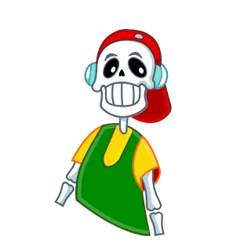

# claude-lottie-skill



A [Claude Code](https://claude.com/claude-code) skill for creating and improving Lottie animations and Telegram stickers (`.tgs`) with code — bring a static sticker to life, polish a weak animation, build a whole pack.

**Spring animation** — poses are set as targets; acceleration, overshoot and settle are simulated; seamless loops.<br>
**Contour morphing** — happy-arc eyes, eyelids, an opening mouth with teeth and tongue, bends, "boiling" surfaces.<br>
**Fake-3D head turns** — one deformation field for the whole head, features shift with parallax.<br>
**World-space cel lighting** — hard shadow terminator, bounce light, highlights on glossy parts; the light stays put while parts rotate.<br>
**FX** — sparkles, steam, tapered motion streaks, glows, ballistic tears.<br>
**Verification** — Telegram limits check, storyboard rendering to PNG, jerk metric, loop-seam check.

<br clear="left"/>

## Install

Copy the `lottie/` folder into `~/.claude/skills/`:

```bash
git clone https://github.com/mxmlab/claude-lottie-skill.git
cp -r claude-lottie-skill/lottie ~/.claude/skills/lottie
```

Then in Claude Code: `/lottie`, or just ask "animate this sticker".

## Quick start without Claude

Requires Python 3.10+ and internet access (the storyboard renderer loads lottie-web from cdnjs).

```bash
mkdir work && cd work
python ../lottie/scripts/unpack.py ../demo/src/*.tgs
PYTHONPATH=../lottie/scripts python ../lottie/scripts/examples/finger_rig_3d_light.py out_pack
```

The result is `out_pack/finger.tgs`. For a storyboard, run `python ../lottie/scripts/srv.py` and open
`http://127.0.0.1:8766/sheet.html?files=out/finger.json&n=8&s=256&out=finger.png` → the PNG lands in `sheets/`.

## Demo

`demo/src/` holds the source stickers, `demo/out/` what the examples turn them into:

| Example | Source | What it does |
|---|---|---|
| `finger_rig_3d_light.py` | `finger.tgs` | finger unfolding joint by joint, eyelids, tongue, 3D head turn, lighting |
| `laugh_mouth_hands.py` | `HEHEHE.tgs` | laughing: open mouth, rigid 3D hands, tears |
| `enhance_existing_stars.py` | `KLASS.tgs` | polishing an existing animation: the stars |

Character art © mxmlab, included for demo purposes only.

## Limitations

- Verified in the browser (lottie-web). Telegram renders stickers with rlottie, where hard lighting gradients may look slightly different.
- Telegram's 64 KB limit: contour morphing is the main size cost, see `D.build(step=…)`.

The full pipeline, verification steps and a list of pitfalls are in [`lottie/SKILL.md`](lottie/SKILL.md) (in Russian).

## License

MIT for the code. Demo art is for reference only.
